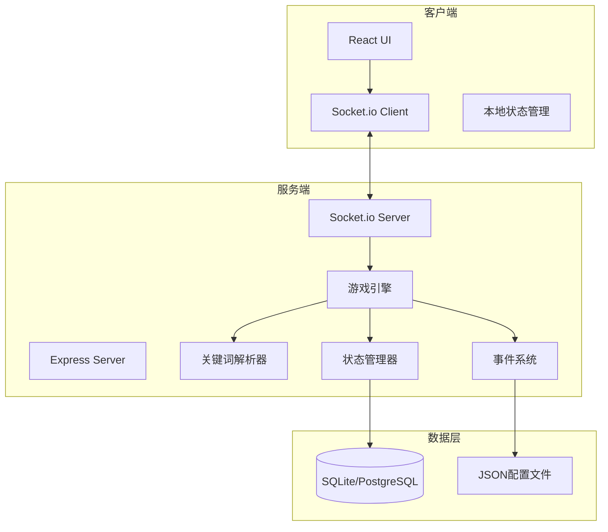

# 设计文档

## 概述

《三兄弟的冒险2》是一款三人在线文字冒险游戏。本设计文档描述系统架构、组件接口、数据模型和技术实现方案。

### 技术栈

- **前端**: React 18 + TypeScript + Vite + TailwindCSS
- **后端**: Node.js + TypeScript + Express + Socket.io
- **数据库**: SQLite（开发）/ PostgreSQL（生产）
- **实时通信**: WebSocket (Socket.io)
- **测试**: Vitest + fast-check (属性测试)

## 架构

### 系统架构图



### 目录结构

```
project/
├── client/                 # 前端代码
│   ├── src/
│   │   ├── components/     # React组件
│   │   ├── hooks/          # 自定义Hooks
│   │   ├── stores/         # 状态管理
│   │   ├── types/          # TypeScript类型
│   │   └── utils/          # 工具函数
│   └── package.json
├── server/                 # 后端代码
│   ├── src/
│   │   ├── engine/         # 游戏引擎
│   │   ├── events/         # 事件系统
│   │   ├── models/         # 数据模型
│   │   ├── routes/         # API路由
│   │   ├── socket/         # WebSocket处理
│   │   └── utils/          # 工具函数
│   └── package.json
├── shared/                 # 前后端共享代码
│   ├── types/              # 共享类型定义
│   └── constants/          # 共享常量
├── config/                 # 游戏配置文件
│   ├── levels/             # 关卡配置
│   ├── events/             # 事件配置
│   └── synonyms.json       # 同义词配置
└── package.json
```

## 组件和接口

### 1. 关键词解析器 (KeywordParser)

负责解析玩家输入的关键词组合，支持同义词识别。

```typescript
interface KeywordCombination {
  keyword1: string;      // 标准化后的第一个关键词
  keyword2: string;      // 标准化后的第二个关键词
  rawInput: string;      // 原始输入
}

interface KeywordParser {
  // 解析输入字符串为关键词组合
  parse(input: string): KeywordCombination | null;
  
  // 将同义词标准化为标准关键词
  normalize(keyword: string): string;
  
  // 检查两个组合是否语义等价
  isEquivalent(a: KeywordCombination, b: KeywordCombination): boolean;
  
  // 序列化组合为字符串
  serialize(combination: KeywordCombination): string;
  
  // 反序列化字符串为组合
  deserialize(str: string): KeywordCombination;
}
```

### 2. 事件系统 (EventSystem)

管理游戏事件的触发、执行和状态更新。

```typescript
interface GameEvent {
  id: string;                    // 事件唯一标识
  trigger: KeywordCombination;   // 触发条件
  prerequisites: string[];       // 前置事件ID列表
  effects: EventEffect[];        // 事件效果列表
  isOneTime: boolean;            // 是否一次性事件
  storyText: string;             // 剧情文本
}

interface EventEffect {
  type: 'health' | 'item' | 'unlock' | 'letter' | 'status';
  target?: string;               // 目标角色或区域
  value: number | string;        // 效果值
}

interface EventSystem {
  // 检查事件是否可触发
  canTrigger(event: GameEvent, state: GameState): boolean;
  
  // 执行事件并返回效果
  execute(event: GameEvent, state: GameState): EventResult;
  
  // 根据关键词组合查找匹配事件
  findEvent(combination: KeywordCombination, levelId: string): GameEvent | null;
}
```

### 3. 状态管理器 (StateManager)

管理游戏状态的读写和持久化。

```typescript
interface GameState {
  roomId: string;
  levelId: string;
  round: number;
  currentPlayerIndex: number;
  players: PlayerState[];
  triggeredEvents: string[];     // 已触发的一次性事件ID
  collectedLetters: string[];    // 已收集的字母
  unlockedAreas: string[];       // 已解锁的区域
  inventory: InventoryItem[];    // 团队物品栏
}

interface PlayerState {
  id: string;
  name: string;
  characterType: 'cat' | 'dog' | 'turtle';  // 内部记录，不显示给玩家
  characterRevealed: boolean;    // 身份是否已揭示
  health: number;
  isIncapacitated: boolean;
  isConnected: boolean;
}

interface StateManager {
  // 获取当前状态
  getState(roomId: string): GameState;
  
  // 更新状态
  updateState(roomId: string, updates: Partial<GameState>): GameState;
  
  // 序列化状态为JSON
  serialize(state: GameState): string;
  
  // 反序列化JSON为状态
  deserialize(json: string): GameState;
  
  // 保存状态到数据库
  save(state: GameState): Promise<void>;
  
  // 从数据库加载状态
  load(roomId: string): Promise<GameState | null>;
}
```

### 4. 房间管理器 (RoomManager)

管理游戏房间的创建、加入和状态。

```typescript
interface Room {
  id: string;
  code: string;                  // 6位房间代码
  players: Player[];
  status: 'waiting' | 'ready' | 'playing' | 'paused';
  createdAt: Date;
  gameState?: GameState;
}

interface Player {
  id: string;
  socketId: string;
  name: string;
  characterIndex?: number;       // 选择的角色编号 (1/2/3)
  isReady: boolean;
  isHost: boolean;
}

interface RoomManager {
  // 创建新房间
  createRoom(hostPlayer: Player): Room;
  
  // 加入房间
  joinRoom(roomCode: string, player: Player): Room | null;
  
  // 离开房间
  leaveRoom(roomId: string, playerId: string): void;
  
  // 获取房间信息
  getRoom(roomId: string): Room | null;
  
  // 开始游戏
  startGame(roomId: string): GameState;
}
```

### 5. WebSocket事件接口

```typescript
// 客户端 -> 服务端
interface ClientEvents {
  'room:create': (playerName: string) => void;
  'room:join': (roomCode: string, playerName: string) => void;
  'room:leave': () => void;
  'room:ready': (characterIndex: number, customName: string) => void;
  'game:start': () => void;
  'game:action': (input: string) => void;
  'game:revive': (targetPlayerId: string) => void;
}

// 服务端 -> 客户端
interface ServerEvents {
  'room:created': (room: Room) => void;
  'room:joined': (room: Room) => void;
  'room:playerJoined': (player: Player) => void;
  'room:playerLeft': (playerId: string) => void;
  'room:error': (message: string) => void;
  'game:started': (state: GameState) => void;
  'game:stateUpdate': (state: GameState) => void;
  'game:eventResult': (result: EventResult) => void;
  'game:turnChange': (currentPlayerId: string) => void;
  'game:characterRevealed': (playerId: string, characterType: string) => void;
}
```

## 数据模型

### 数据库Schema

```sql
-- 房间表
CREATE TABLE rooms (
  id TEXT PRIMARY KEY,
  code TEXT UNIQUE NOT NULL,
  status TEXT NOT NULL DEFAULT 'waiting',
  created_at TIMESTAMP DEFAULT CURRENT_TIMESTAMP,
  updated_at TIMESTAMP DEFAULT CURRENT_TIMESTAMP
);

-- 玩家表
CREATE TABLE players (
  id TEXT PRIMARY KEY,
  room_id TEXT REFERENCES rooms(id),
  name TEXT NOT NULL,
  character_index INTEGER,
  character_type TEXT,
  is_host BOOLEAN DEFAULT FALSE,
  is_ready BOOLEAN DEFAULT FALSE,
  created_at TIMESTAMP DEFAULT CURRENT_TIMESTAMP
);

-- 游戏状态表
CREATE TABLE game_states (
  id TEXT PRIMARY KEY,
  room_id TEXT UNIQUE REFERENCES rooms(id),
  level_id TEXT NOT NULL,
  round INTEGER DEFAULT 1,
  current_player_index INTEGER DEFAULT 0,
  state_json TEXT NOT NULL,
  created_at TIMESTAMP DEFAULT CURRENT_TIMESTAMP,
  updated_at TIMESTAMP DEFAULT CURRENT_TIMESTAMP
);

-- 存档表
CREATE TABLE saves (
  id TEXT PRIMARY KEY,
  room_id TEXT REFERENCES rooms(id),
  state_json TEXT NOT NULL,
  created_at TIMESTAMP DEFAULT CURRENT_TIMESTAMP
);
```

### 配置文件格式

#### 同义词配置 (synonyms.json)

```json
{
  "characters": {
    "cat": ["猫", "猫咪", "天一", "玩家1", "角色1"],
    "dog": ["狗", "狗狗", "二水", "玩家2", "角色2"],
    "turtle": ["龟", "乌龟", "包子", "玩家3", "角色3"]
  },
  "items": {
    "wardrobe": ["衣柜", "柜子", "大衣柜"],
    "vase": ["花瓶", "瓶子"],
    "pool": ["水潭", "水池", "池子"]
  }
}
```

#### 关卡事件配置 (levels/level1.json)

```json
{
  "levelId": "level1",
  "name": "密室逃脱",
  "initialAreas": ["main_room"],
  "events": [
    {
      "id": "evt_001",
      "trigger": { "keyword1": "cat", "keyword2": "wardrobe" },
      "prerequisites": [],
      "effects": [
        { "type": "unlock", "value": "small_room" },
        { "type": "letter", "value": "E" }
      ],
      "isOneTime": true,
      "storyText": "猫咪钻进衣柜，发现了一个隐藏的小房间！在角落里找到了字母 E。"
    }
  ]
}
```

## 正确性属性

*属性是一种应该在系统所有有效执行中保持为真的特征或行为——本质上是关于系统应该做什么的正式声明。属性作为人类可读规范和机器可验证正确性保证之间的桥梁。*


### 属性反思

经过分析，以下属性可以合并或简化：
- 3.5和3.6可合并为关键词组合往返属性
- 6.5和6.6可合并为游戏状态往返属性
- 9.3和9.4与6.5/6.6重复，合并为一个往返属性
- 4.2和4.4可合并为回合轮转属性

### 正确性属性

**属性1：房间代码唯一性**
*对于任意*多个房间创建请求，每个生成的房间代码都应该是唯一的
**验证: 需求 1.1**

**属性2：房间加入规则**
*对于任意*房间状态和加入请求，当房间人数少于3人时应允许加入，等于3人时应拒绝
**验证: 需求 1.2, 1.3**

**属性3：角色信息隐藏**
*对于任意*未揭示身份的玩家，返回给客户端的角色信息不应包含动物类型
**验证: 需求 2.1, 2.2**

**属性4：关键词解析往返**
*对于任意*有效的关键词组合对象，序列化后再反序列化应产生语义等价的对象
**验证: 需求 3.5, 3.6**

**属性5：同义词标准化一致性**
*对于任意*同义词列表中的词，标准化后应得到相同的标准关键词
**验证: 需求 3.4**

**属性6：回合轮转正确性**
*对于任意*游戏状态，当当前玩家完成行动后，回合应正确推进到下一个玩家；当所有玩家完成一轮后，回合计数器应增加1
**验证: 需求 4.2, 4.4**

**属性7：非当前玩家行动拒绝**
*对于任意*游戏状态和非当前玩家的行动请求，系统应拒绝该行动
**验证: 需求 4.3**

**属性8：复活机制正确性**
*对于任意*复活操作，复活者生命值应减少2点，被复活者生命值应变为1点
**验证: 需求 5.4**

**属性9：第一关生命值保护**
*对于任意*第一关的生命值变化事件，角色生命值不应降至1点以下
**验证: 需求 5.5**

**属性10：一次性事件幂等性**
*对于任意*一次性事件，触发一次后再次触发应无效果
**验证: 需求 6.2**

**属性11：前置条件检查**
*对于任意*有前置条件的事件，只有当所有前置事件已触发时才能执行
**验证: 需求 6.1**

**属性12：游戏状态往返**
*对于任意*有效的游戏状态对象，序列化为JSON后再反序列化应产生等价的状态对象
**验证: 需求 6.5, 6.6, 9.3, 9.4**

**属性13：密码验证正确性**
*对于任意*字母收集状态，只有当收集了全部4个字母(C,E,H,O)时，密码"ECHO"才应验证通过
**验证: 需求 8.3**

## 错误处理

### 客户端错误

| 错误类型 | 处理方式 |
|---------|---------|
| 无效输入格式 | 显示格式提示，不发送到服务端 |
| 网络断开 | 显示重连提示，自动尝试重连 |
| 非当前回合操作 | 显示等待提示 |

### 服务端错误

| 错误类型 | 处理方式 |
|---------|---------|
| 房间不存在 | 返回错误码，提示重新输入 |
| 房间已满 | 返回错误码，提示房间已满 |
| 无效关键词组合 | 返回无效果提示 |
| 数据库错误 | 记录日志，返回通用错误 |

## 测试策略

### 单元测试

使用 Vitest 进行单元测试，覆盖：
- 关键词解析器的解析和标准化逻辑
- 事件系统的条件检查和效果执行
- 状态管理器的状态更新逻辑
- 房间管理器的房间操作

### 属性测试

使用 fast-check 进行属性测试，验证：
- 所有正确性属性（属性1-13）
- 每个属性测试运行至少100次迭代
- 测试注释格式：`**Feature: three-brothers-adventure, Property {number}: {property_text}**`

### 集成测试

- WebSocket通信测试
- 完整游戏流程测试
- 多玩家同步测试
